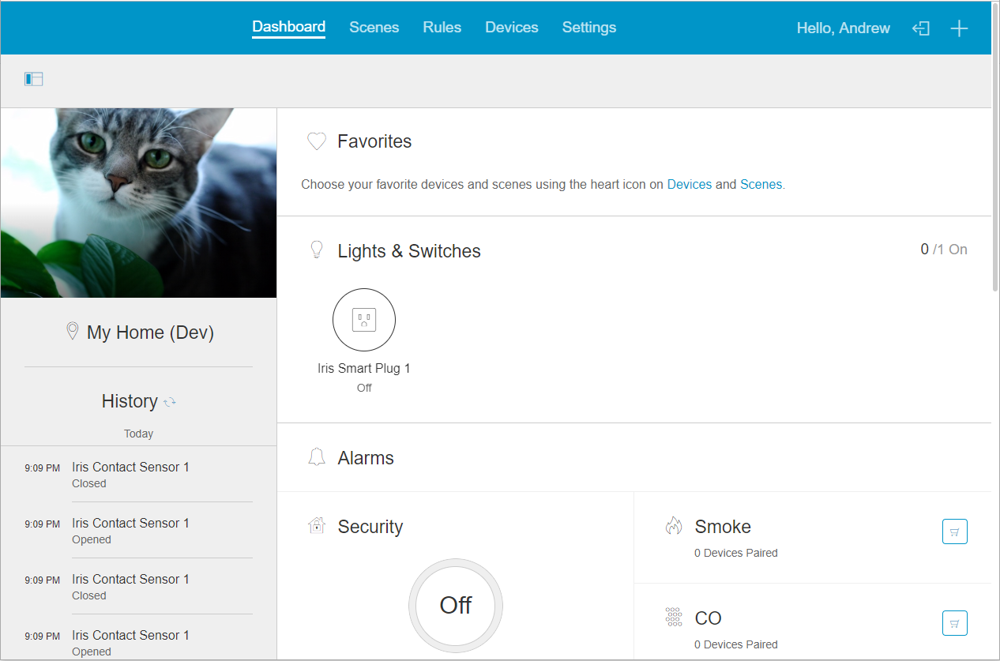

Arcus is an open-source home automation and control system, based on the Iris by Lowes codebase.
This project contains the files necessary to run Arcus Platform, including the backend services and portions of the hub (agent).

# Other Repositories

Arcus Platform does not contain a UI (beyond oculus, which is in Java). If you wish to access Arcus from a phone or web browser check out the other repositories under arcus-smart-home, these include:

* **arcusandroid** - Android app for Arcus Platform
* **arcusios** - iOS app for Arcus Platform
* **arcusweb** - donejs web ui for Arcus Platform.
* **arcusipcd** - IP Connected Device Protocol Implementation
* **arcushubos** - Yocto Linux based HubOS Firmware

# High Level Overview
Please see [Overview](docs/overview.md) for details. At present, local development is tricky to get setup and takes a considerable amount of time to configure. It is instead recommended that you setup Arcus in a container system, for example Kubernetes. See the community effort [arcus-k8](https://github.com/wl-net/arcus-k8) for details.

Please see [README.projects](docs/projects.md) for details on the layout of this project. Individual subdirectories may have their own additional documentation.

# Support

Please use http://forum.livingwithiris.com/forum/62-arcus/ for support and general questions.
