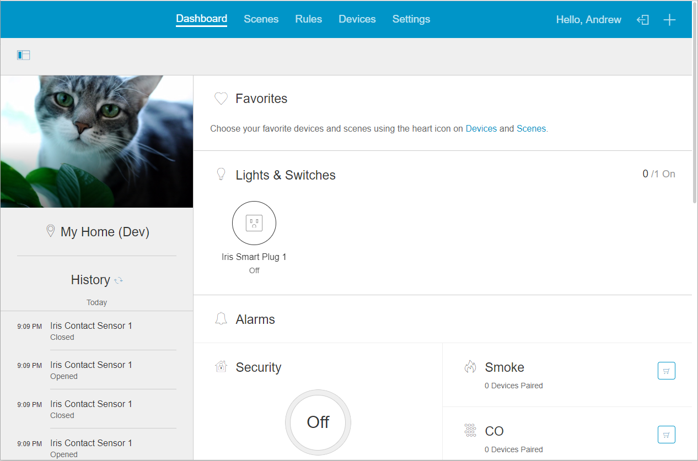

# Arcus Platform

Arcus is an open-source home automation and control system, based on the Iris by Lowes codebase. This project contains the files necessary to run Arcus Platform, including the backend services and portions of the hub (agent).

## Getting Started

At present, local development is tricky to set up and takes a considerable amount of time to configure. It is instead recommended that you set up Arcus in a container system, for example Kubernetes. See the community effort [arcus-k8s](https://github.com/wl-net/arcus-k8) for details.

- [Overview](overview.md) — High-level architecture and how components fit together
- [Projects](projects.md) — Layout of this repository and its subprojects
- [Platform](platform.md) — Platform services documentation
- [Hub](hub.md) — Hub agent documentation
- [Drivers](driver.md) — Driver development guide

## Other Repositories

Arcus Platform does not contain a UI (beyond oculus, which is in Java). If you wish to access Arcus from a phone or web browser check out the other repositories under arcus-smart-home:

- **arcusandroid** — Android app for Arcus Platform
- **arcusios** — iOS app for Arcus Platform
- **arcusweb** — donejs web UI for Arcus Platform
- **arcusipcd** — IP Connected Device Protocol Implementation
- **arcushubos** — Yocto Linux based HubOS Firmware

## Support

Please use [GitHub Issues](https://github.com/wl-net/arcusplatform/issues) for support and general questions.
